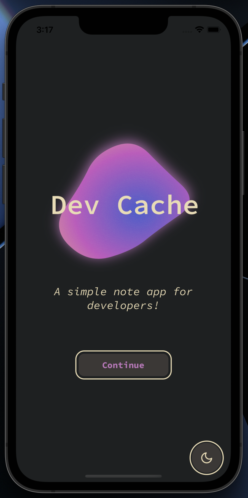
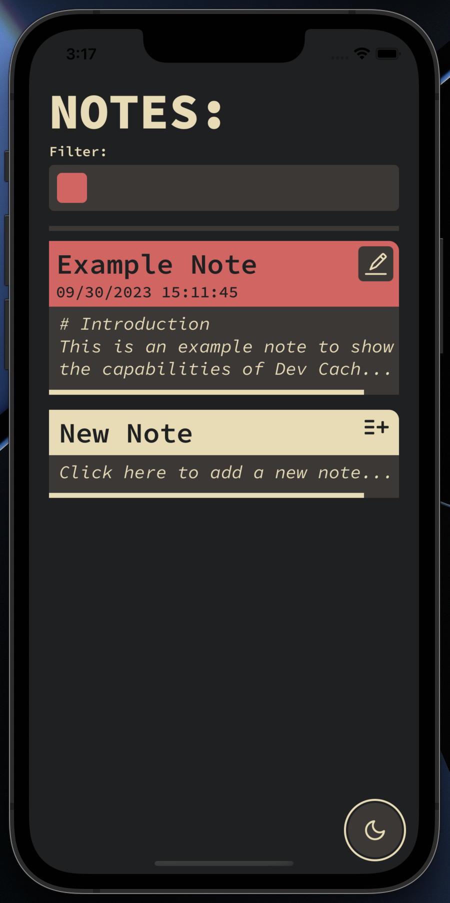
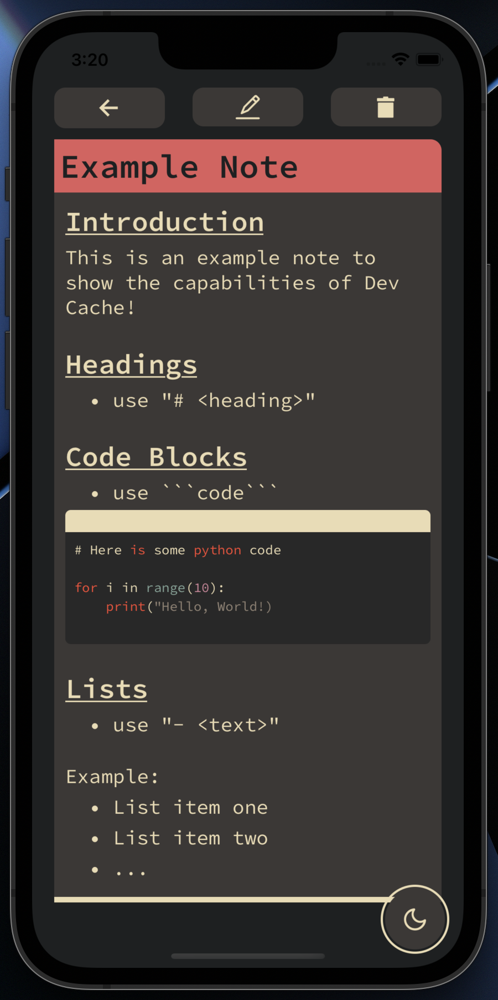
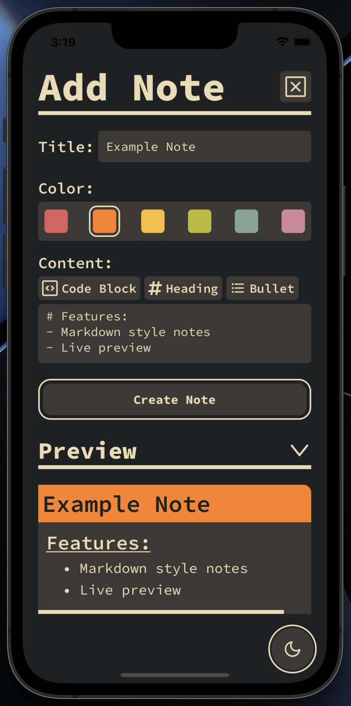
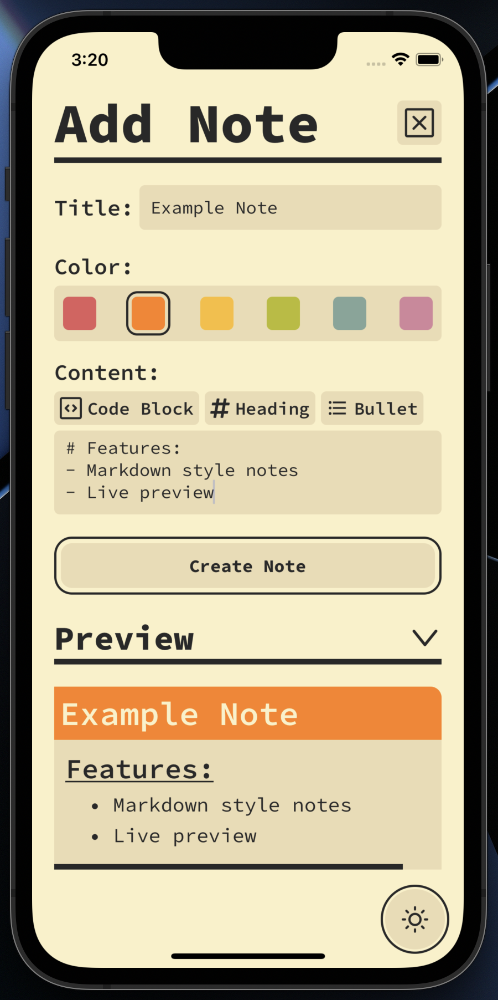

# Dev Cache - a simple note taking app for developers

## Capabilities:
- Write notes in Markdown (w/ a live preview)
- Syntax highlighting for code blocks
- Edit, create, and delete notes
- Filter notes by color
- Light/Dark Mode

## Tools/Skills Learned:
- React Native / Expo SDK 49
- File based routing
- AsyncStorage for Notes
- Animations w/ Reanimated